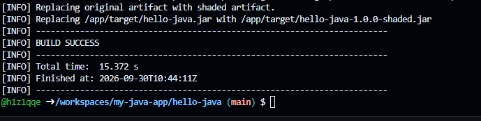
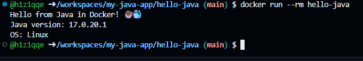

Вот лаконичный, стильный и структурированный вариант `README.md`. Я убрал излишнюю «воду», сгруппировал информацию в компактные блоки и сделал акцент на ключевых этапах (особенно там, где у вас есть скриншоты: 2.1 и 2.3).

Просто скопируйте код ниже и сохраните как `README.md`.

# ☕ Java CI Pipeline

### Учебный проект: сборка Java-приложения с Maven, JUnit 5 и Multi-stage Docker в GitHub Actions


**Цель:** освоить жизненный цикл Maven, написание тестов на JUnit 5, создание «толстого» JAR (Shade Plugin) и минимизацию размера Docker-образа через Multi-stage сборку.


## 📋 Структура проекта

```text
hello-java/
├── .github/workflows/ci.yml   # Пайплайн CI
├── src/
│   ├── main/java/Hello.java   # Исходный код
│   └── test/java/HelloTest.java # JUnit 5 тесты
├── pom.xml                    # Конфигурация Maven
├── Dockerfile                 # Multi-stage сборка
└── .gitignore
```

> 💡 **Быстрый старт:** всю структуру и файлы можно создать одной командой в терминале:
> ```bash
> mkdir -p hello-java/{.github/workflows,src/main/java,src/test/java} && cd hello-java
> # (далее используйте содержимое файлов из этого репозитория)
> ```

---

## ⚙️ Ключевые файлы

### 🐳 Dockerfile (Multi-stage)
Разделяем среду сборки (тяжелый Maven + JDK) и среду выполнения (легкий JRE Alpine), чтобы итоговый образ был минимальным.
```dockerfile
# Этап 1: сборка
FROM maven:3.9-eclipse-temurin-17 AS builder
WORKDIR /build
COPY pom.xml .
COPY src ./src
RUN mvn clean package -DskipTests

# Этап 2: минимальный образ для запуска
FROM eclipse-temurin:17-jre-alpine
WORKDIR /app
COPY --from=builder /build/target/hello-java.jar app.jar
ENTRYPOINT ["java", "-jar", "app.jar"]
```

### 🔄 GitHub Actions (`.github/workflows/ci.yml`)
Автоматизирует проверку кода при каждом `push` или `pull_request`.
```yaml
name: Java CI
on: [push, pull_request]

jobs:
  build:
    runs-on: ubuntu-latest
    steps:
      - uses: actions/checkout@v4
      - name: Set up JDK 17
        uses: actions/setup-java@v4
        with:
          java-version: '17'
          distribution: 'temurin'
          cache: maven # Кэширование зависимостей для ускорения
      - name: Build and test
        run: mvn clean verify
      - name: Build Docker image
        run: docker build -t hello-java .
```
*(Полный код `pom.xml`, `Hello.java` и `HelloTest.java` доступен в файлах репозитория)*

---

## 🚀 Этапы выполнения и результаты

### 2.1. Сборка и тесты внутри Docker (без установки Maven на хост)
Используем контейнер Maven для сборки, монтируя кэш зависимостей, чтобы не скачивать их каждый раз.

**Команда (Linux/macOS/WSL):**
```bash
mkdir -p ~/.m2-docker-cache
docker run --rm -u "$(id -u):$(id -g)" -e HOME=/tmp -e MAVEN_CONFIG=/tmp/.m2 \
  -v "$(pwd)":/app -v ~/.m2-docker-cache:/tmp/.m2 -w /app \
  maven:3.9-eclipse-temurin-17 mvn clean verify
```
*(Для Windows используется аналогичная команда с `` ` `` и `-v "${PWD}:/app"`)*

<div align="center">
  <!-- ЗАМЕНИТЕ ПУТЬ НА РЕАЛЬНЫЙ ПУТЬ К ВАШЕМУ СКРИНШОТУ ЭТАПА 2.1 -->
  
  <p><em>✅ Успешное выполнение фаз clean и verify внутри контейнера</em></p>
</div>

---

### 2.3. Запуск собранного Docker-образа
После сборки образа (`docker build -t hello-java .`) запускаем его. Образ содержит только JRE, что делает его легким и безопасным.

**Команда:**
```bash
docker run --rm hello-java
```

**Ожидаемый вывод:**
```text
Hello from Java in Docker! ☕🐳
Java version: 17.0.x
OS: Linux
```

<div align="center">
  <!-- ЗАМЕНИТЕ ПУТЬ НА РЕАЛЬНЫЙ ПУТЬ К ВАШЕМУ СКРИНШОТУ ЭТАПА 2.3 -->
  
  <p><em>✅ Успешный запуск приложения в минимальном Alpine-контейнере</em></p>
</div>

---

## 📤 Публикация на GitHub

Если вы создаете репозиторий с нуля на новом компьютере:

```bash
# 1. Настройка Git (если не сделано)
git config --global user.name "Ваше Имя"
git config --global user.email "ваш@email.com"

# 2. Инициализация и коммит
git init
git add .
git commit -m "Initial commit: Java app with Docker and CI"
git branch -M main

# 3. Привязка и отправка (замените ВАШ-USERNAME)
git remote add origin https://github.com/ВАШ-USERNAME/hello-java.git
git push -u origin main
```
> ⚠️ **Важно:** Создавайте репозиторий на GitHub **пустым** (без README, .gitignore и лицензии), иначе `push` будет отклонен из-за конфликта историй.

---

## 🛠️ Решение частых проблем

| Ошибка | Решение |
|:---|:---|
| `Repository not found` | Проверьте опечатку в URL `git remote -v` и права доступа к репозиторию. |
| `Authentication failed` | Используйте [Personal Access Token](https://github.com/settings/tokens) вместо пароля или настройте SSH-ключ. |
| `Rejected (non-fast-forward)` | На GitHub уже есть файлы. Выполните: `git pull --rebase origin main`, затем `git push`. |
| `src refspec main does not match any` | Вы забыли сделать коммит. Выполните `git add .` и `git commit -m "..."`. |

---


  <sub>Нашли ошибку или неточность? Сообщите автору! ✉️</sub><br>
  <sub>Сделано с ❤️ и ☕</sub>


### 💡 Что нужно сделать перед сохранением:
1. Создайте в корне проекта папку `img` (если её еще нет).
2. Переименуйте ваши скриншоты в `step_2_1_maven_build.png` и `step_2_3_docker_run.png` и положите их в эту папку (или измените пути `src="..."` в коде выше на ваши реальные имена файлов).
3. Благодаря использованию `<details>`-подобной компактности и таблиц, файл выглядит профессионально, не перегружает читателя и сразу ведет к сути (скриншотам и результатам).